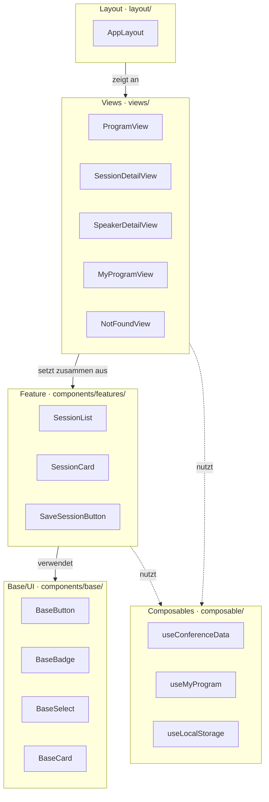

# ADR-0002: Komponenten- und Ordnerstruktur nach Schichten

## Status

Accepted

## Datum

2026-10-10

## Kontext

Die Konferenz-App besteht aus mehreren Seitentypen (Programmübersicht, Session- und Speaker-Detailseiten, personalisiertes Dashboard „Mein Programm"). Viele Bausteine kommen auf mehreren Seiten vor, z. B. Session-Karten, Badges oder der „Merken"-Button.

Wir sind zu zweit. Wir brauchen deshalb eine Struktur, in der klar ist, wo eine neue Datei hingehört und welche Komponente was darf. Das State-Management mit Composables ist in ADR-0003 festgelegt, das Setup mit Vue + Vite + vue-router in ADR-0004.

## Betrachtete Optionen

### Ordner nach Schichten (Base, Feature, Layout, Views)
- Vorteile: klare Verantwortlichkeiten, Abhängigkeiten nur von oben nach unten, für eine kleine App leicht überschaubar
- Nachteile: Dateien eines Features (z. B. `SaveSessionButton` und `useMyProgram`) liegen in verschiedenen Ordnern

### Ordner nach Features (features/programm/, features/mein-programm …)
- Vorteile: alles zu einem Feature liegt beisammen, skaliert gut bei großen Apps
- Nachteile: Komponenten, die mehrere Features brauchen (z. B. die Session-Karte), passen in keinen Feature-Ordner. Für unsere 4–5 Seiten ist das mehr Struktur als Inhalt.

### Option 3: Flache Struktur (alle Komponenten in `components/`)
- Vorteile: kein Nachdenken über die Ablage, schnell begonnen
- Nachteile: Schon bei 15–20 Komponenten ist nicht mehr erkennbar, welche Komponente wiederverwendbar ist und welche App-Logik enthält

## Entscheidung

Wir verwenden eine Ordnerstruktur nach Schichten:

```
src/
├── assets/            
├── components/
│   ├── base/          Base/UI: wiederverwendbare Bausteine ohne App-Wissen
│   ├── features/      Feature: fachliche Komponenten mit App-Wissen
│   └── icons/         
├── composable/        Logik und States (siehe ADR-0003)
├── data/              conference-data.json
├── layout/            Seitenrahmen (Header, Navigation, Footer)
├── router/            Routen-Konfiguration (vue-router)
├── style/             Design Tokens (tokens.css)
└── views/             eine Komponente pro Route
```


### Headless-Prüfung

**„Zum Programm hinzufügen": Headless ist sinnvoll.**
Dieselbe Logik (merken, entfernen, prüfen, ob gemerkt) wird an drei Stellen mit unterschiedlicher Darstellung gebraucht: als Button auf der Session-Karte, als Umschalter auf der Detailseite und als „Entfernen" im Dashboard. Die Logik liegt daher vollständig in `useMyProgram` (inkl. Speichern im localStorage). Die Komponenten rufen nur `add`, `remove` und `isSaved` auf und gestalten die Darstellung selbst. So bleibt der Zustand überall synchron, und eine neue Darstellung braucht keine neue Logik.

## Komponentenübersicht



- **Layout:** `AppLayout` mit Header, Navigation und Footer
- **Views:** `ProgramView` (Übersicht), `SessionDetailView`, `SpeakerDetailView`, `MyProgramView` (Dashboard), `NotFoundView`
- **Feature:** `SessionList`, `SessionCard`, `SaveSessionButton`
- **Base/UI:** `BaseButton`, `BaseBadge`, `BaseSelect`, `BaseCard`
- **Composables:** `useConferenceData`, `useMyProgram`, `useLocalStorage` (ADR-0003)

## Konsequenzen

### Positiv
- Für jede neue Datei ist klar, in welchen Ordner sie gehört
- Base-Komponenten sind ohne App-Wissen wiederverwendbar und nutzen nur Design Tokens
- Die Merken-Logik existiert genau einmal, egal wie viele Darstellungen es gibt
- Wir können parallel arbeiten, z. B. eine Person an Base-Komponenten, die andere an Views

### Negativ
- Zu einem Feature gehörende Dateien liegen in verschiedenen Ordnern (Komponente in `features/`, Logik in `composable/`)
- Bei jeder Komponente muss entschieden werden, ob sie Base oder Feature ist

### Risiken
- Die Grenze zwischen Base und Feature verschwimmt, wenn Base-Komponenten doch Konferenzdaten bekommen. Gegenmaßnahme: Base-Komponenten erhalten nur einfache Props (Text, Farbe, Zustand), nie ganze Session-Objekte.
- Die Regeln werden von keinem Tool geprüft und müssen im Code-Review eingehalten werden.

## Verwandte Entscheidungen

- ADR-0003: State-Management mit Composables
- ADR-0004: Vue + Vite + vue-router + TypeScript für Projekt Setup
