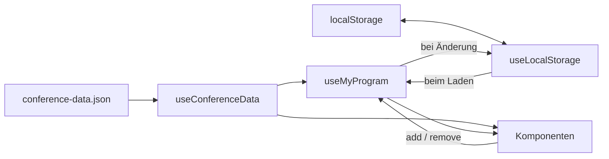

# ADR-0003: State-Management mit Composables

## Status

Accepted

## Datum

[2026-10-08]

## Kontext

Die App arbeitet mit zwei verschiedenen Daten, den Konferenzdaten (Sessions), diese sind für alle gleich und werden nur gelesen, und den Daten von "mein Programm", hier handelt es sich um die Sessions, die sich ein Nutzer merkt. Diese ändern sich und müssen nach einen Reload auch noch vorhanden sein. 

Die Daten werden von mehreren Seiten gleichzeitig gebraucht. Wenn also eine Session beispielsweise hinzugefügt wird, dann muss das für überall sichtbar sein. 

In der Hausüberung 2 haben wir schon verschiedenste Technologien (z.B. Composables) kennen gelernt, die hier eigesetzt werden können. 

## Entscheidung

es gibt drei Composabeles: 
- useConferenceData: lädt die Json-datei einmal und gibt die Sessions zurück
- useMyProgram: speichert die Liste von den Session-IDs
- useLocalStorage: speichert die IDs im local Storage und lädt diese beim Start 

Es werden nur die IDs gespeichert, nicht die ganzen Session-Objekte. Die Daten liegen ausperhalb der Composables. 
Die Komponeten teilen sich die Daten, ändern diese jedoch nie direkt, sondern rufen eine Funktion dafür auf. 

**Beschreibung:**
- auf die Datei conference-data.json wird nur von uscConferenceData zugegriffen. Es lädt die Datei einmal und stellt die Sessionsinformationen bereit.
- useLocalStorage ist die einzige Stelle, die auf den localStorage zugreift. 
- useMyProgram merkt sich die IDs der gewählten Sessions und verbindet sie mit den vollständigen Sessioninformationen aus conference-data.json
- wird neugeladen ließt useMyProgram über useLocalStorage die gespeicherten IDs ein. Bei jeder Änderung schreibt es auch die neuen Änderungen in die ID-Liste zurück. 
- in den Komponeten werden nur Funktionen(add oder remove) aufgerufen. Sie ändern die Daten allerdings nie direkt. 
- Komponeten wie beispielsweise die Übersichtsseite kann infomationen auch direkt von useConferenceData holen

## Betrachtete Alternativen

### Pinia
- Vorteile: klare Struktur, gute Tools
- Nachteile: unbekannte/neue Libary - muss erst gelernt werden
- Warum abgelehnt: für die Größe der App sollten composables ausreichen und die Funktionsweise ist von diesen aus Hausübung 2 bekannt

###  ganze Session Objekte
- Vorteile: das Dashboard würde die JSON-datei nicht brauchen 
- Nachteile: man arbeitet quasi mit doppelten Daten. - es gibt bei Änderungen immer noch veraltete Kopien 
- Warum abgelehnt: die IDs ändern sich nie, daher halten sie das ganze aktuell, daher wird mit diesen gearbeitet

## Konsequenzen

### Positiv
- localStoarge wird nur an einer Stelle verwendet
- das Muster ist bekannt
- die Komponeten werden syncron gehalten 

### Negativ
- die Anzeige beim Dashboard braucht zusätzlich immer auch die Konferenzdaten 
- wahrscheinlich weniger sauber als mit Pina, da bestimmte Tools fehlen

### Risiken
- wenn eine Session aus der JSON gelöscht wird, beleibt aber grundlegend die ID für diese Session noch bestehen - eine Lösung: wäre dies IDs zu ignorieren
- der localStorage könnte mal leer seinen oder im schlimmsten fall sogar kaputt sein - Lösung: hier muss abgefangen werden (try/catch)

## Verwandte Entscheidungen

- keine
